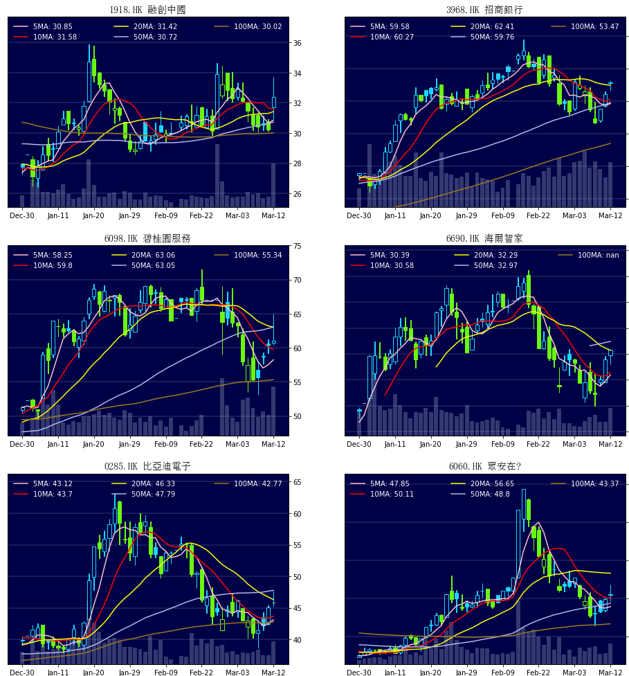
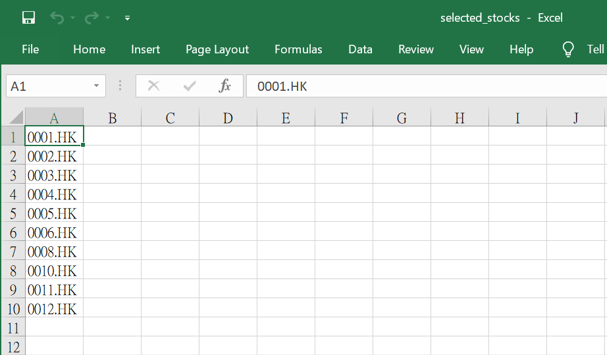
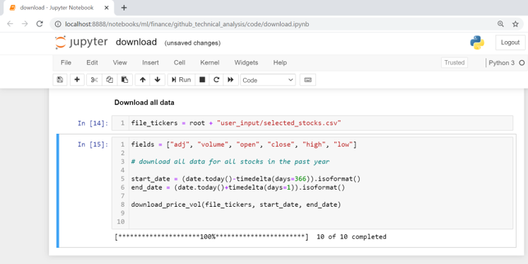
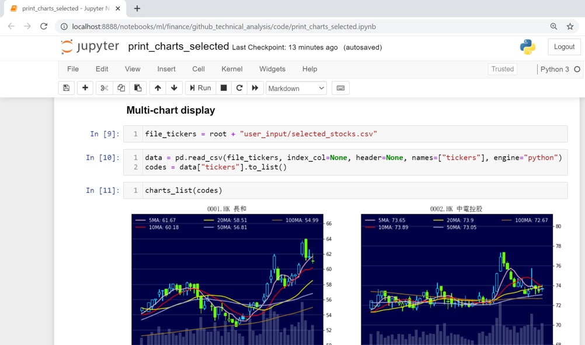

# Multi-Chart Display for Technical Stock Analysis

## Problem Statement
Every day technical analysts are required to perform two main tasks:
- scan hundreds and thousands of stocks
- take a closer look at the charts of selected stocks based on certain criteria.

The first step involves downloading relevant financial data (eg stock price, trading volume), then process and consolidate the data, ready to be used for further analysis (moving averages, trend lines, volume changes).

The pain point lies in the second step, where technical analysts often need to type in the stock code in some sort of terminals or applications, in order to see the detailed stock charts.
As there are potentially hundreds of charts to look at, it is time-consuming to key in all the stock codes one at a time, and this manual operation is not ideal for stock comparison.

This notebook aims to provide a simple tool to resolve this problem.

## Data Visualization

### Sample of Multi-Chart Display
This tool allows users to glance the stock price .charts of selected stocks on one single page. Below is the sample display of price charts

Best for technical stock analysts (or chartists).

Figure 1: Sample of stock charts on watch list

## Steps
3 steps to follow:

#### First Step: User Input
- key in the stock codes in file "user_input/selected_stocks.csv"
- note that the stock codes should refer to 
- there is a selected list of stock names for liquid Hong Kong stocks ("data/hk_names.csv")

Figure 2: Screenshot of how to key in selected stocks

#### Second step: Download Stock Data
- load and run the notebook "code/download.ipynb"
- successful download will be shown at the bottom

Figure 3: Screenshot of successful stock data download

#### Third step: Display Multiple Charts
- load and run the notebook "code/print_charts_selected.ipynb"

Figure 4: Screenshot of successful multi-chart display

## Further development
Users are advised to apply different trading strategies based on the stock price and volume data, in order shortlist the stocks to be on watch.
Please refer to "sample_charts.md" for more examples

## References
- yfinance library - for crawling yahoo finance website and parsing the html into data
- aastocks.com - for giving the inspiration of stock chart formatting

## Folder Organization

    |__ code/
    |   |__ download.ipynb
    |   |__ print_charts_selected.ipynb
    |__ common/
    |   |__ my_functions_selected.ipynb
    |__ user_input/
    |   |__ selected_stocks.csv
    |__ data/
    |   |__ adj.csv
    |   |__ low.csv
    |   |__ high.csv
    |   |__ open.csv
    |   |__ close.csv
    |   |__ volume.csv	
    |   |__ hk_names.csv	
    |__ images/
    |   |__ chart_sample.png
    |   |__ chart1.png
    |   |__ chart2.png
    |   |__ chart3.png
    |   |__ screenshot_user_input.png
    |   |__ screenshot_download.png
    |   |__ screenshot_multi.png
	1__ README.md
	1__ sample_charts.md
	
