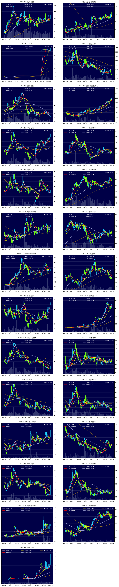
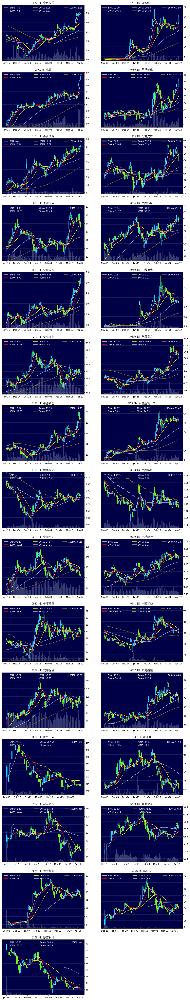
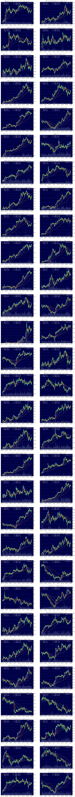
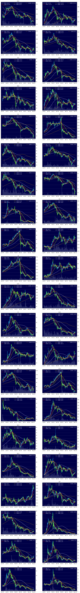

# Sample charts

[HK Stocks with increased trading value](#HK-stocks-with-increased-trading-value)

[HK stocks with strongest trends](#HK-stocks-with-strongest-trends)

[HK Stocks best performing stocks 5 days](#HK-stocks-best-performing-stocks-5-days)

[HSI components](#HSI-components)

[HK stocks on watch list](#HK-stocks-on-watch-list)

[US stocks hovering around 50MA](#US-stocks-hovering-around-50ma)

[US stocks with China concept](#US-stocks-with-china-concept)

## HK stocks with increased trading value

## HK stocks with strongest trends

## HK Stocks best performing stocks 5 days

## HSI components

## HK stocks on watch list

## US stocks hovering around 50MA

## US stocks with China concept
