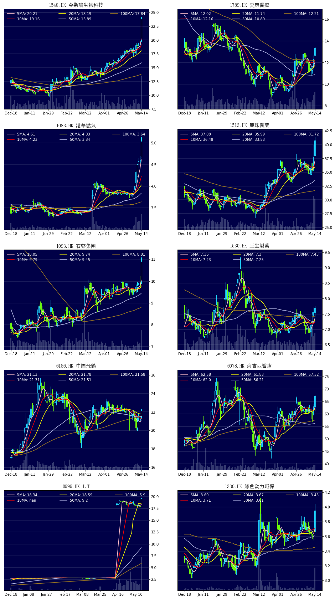
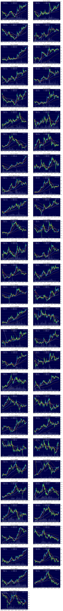

# Sample charts (for illustration only)

[HK Stocks with increased trading value](#HK-stocks-with-increased-trading-value)

[HK stocks with strongest trends](#HK-stocks-with-strongest-trends)

## HK stocks with increased trading value

## HK stocks with strongest trends

## Hong Kong Stocks - best performing stocks (5 days)

## Hong Kong Stocks - HSI components

## Hong Kong Stocks - watch list

